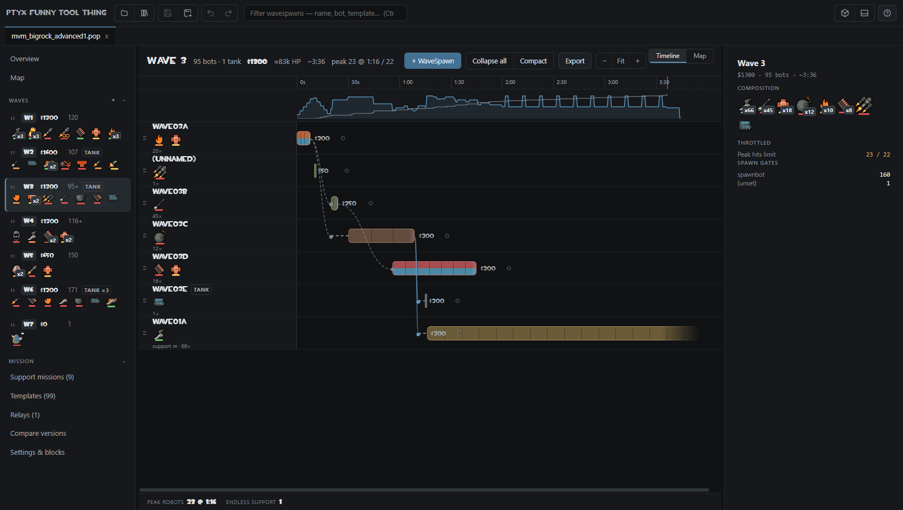
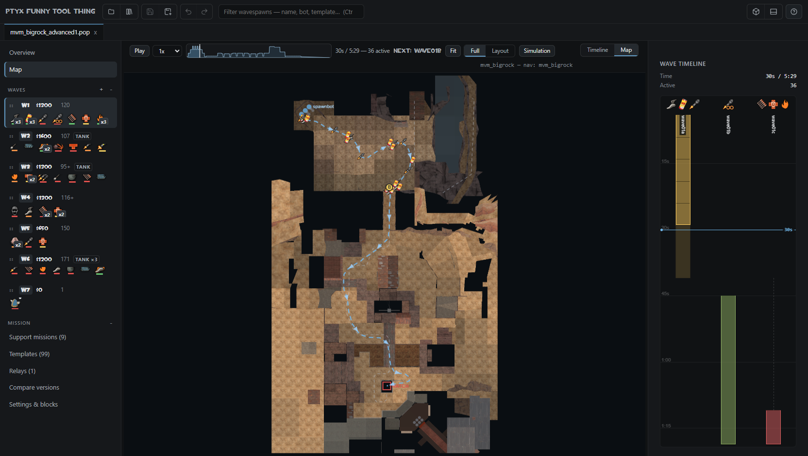

# pop visualizer



## What is this

pop visualizer is a desktop visualizer, editor, and wave simulator for Team Fortress 2 Mann vs. Machine popfiles. It supports Valve missions and RafMod extensions.

Team Fortress 2 does not need to be running or installed to open and edit popfiles. If it is installed, the application can use its robot icons, maps, navigation meshes, materials, fonts, and models.

## Features

- Timeline visualization for waves and WaveSpawns
- Dependency, spawn timing, robot count, and currency visualization
- Formatting-preserving popfile editing
- Wave and map simulation
- Mission, template, relay, and model browsers
- Popfile linting and version comparison
- PNG timeline export
- Multi-file tabs, undo and redo, crash recovery, and external-change detection
- Bundled Valve missions and stock bot templates
- Dock mode for external editors on Windows
- Rust and WebAssembly navigation kernel for the map simulation



## Installation

Download a build from the [Releases page](https://github.com/ptx12/pop-visualizer/releases).

### Windows

Use the setup executable for a normal installation or the portable executable to run the application without installing it.

The portable version still stores its settings in the current user's application-data directory. Dock mode requires Windows and PowerShell.

### Linux

AppImage:

```bash
chmod +x pop-visualizer-<version>-<arch>.AppImage
./pop-visualizer-<version>-<arch>.AppImage
```

If the AppImage does not work because FUSE is unavailable, use the tarball:

```bash
tar -xzf pop-visualizer-<version>-<arch>.tar.gz
cd <extracted-directory>
./pop-visualizer
```

Dock mode is not available on Linux.

### macOS

There is no macOS build. Running from source may work, but it has not been tested. Dock mode is not available.

### From source

Node.js 20 or later, npm, and Git are required.

```bash
git clone https://github.com/ptx12/pop-visualizer.git
cd pop-visualizer
npm ci
npm start
```

## TF2 setup

The application searches the usual Steam locations, including secondary Steam libraries and Flatpak or Snap installations.

If TF2 is not detected, open **Settings** and select this directory manually:

```text
<Steam library>/steamapps/common/Team Fortress 2/tf
```

Select the `tf` directory itself, not the `Team Fortress 2` directory.

## Things to know

- Windows and Linux builds are x64 only.
- Simulation is an estimate and does not replace testing the mission in TF2. Player damage, kill timing, gate captures, and similar runtime events cannot be known from the popfile alone.
- Mission-level support bots such as support Snipers, Spies, and Sentry Busters are not included in WaveSpawn simulation.
- Maps and navigation files are matched by mission name. Unusual mission names or missing assets may produce an approximate match or reduced map output.
- Popfiles are read and written as Latin-1. Saving is blocked if an edit contains unsupported characters.
- Community maps and models downloaded through the application are written to `tf/download`.
- Saves are atomic and preserve untouched formatting, but important missions should still be backed up or kept in version control.

## Development

Run the tests:

```bash
npm test
```

Run the renderer in a browser:

```bash
npm run dev
```

Create an unpacked build:

```bash
npm run pack
```

Build release packages for the current platform:

```bash
npm run dist
```

Builds are written to `dist/`. Building on the target operating system is recommended.

### Navigation kernel (Rust)

The bot movement hot path — nav mesh lookups, Dijkstra flow fields, and per-step movement — is implemented in Rust under `rust/navkernel` and compiled to WebAssembly at `shared/navkernel.wasm`. On a 91-bot wave this takes the map simulation from about 1000 ms to about 220 ms.

The compiled `.wasm` is committed, so running or packaging the application needs no Rust toolchain. Only rebuilding it does:

```bash
rustup target add wasm32-unknown-unknown
npm run build:wasm
```

The JavaScript implementation is retained and used automatically if the module fails to load, so the application still runs without it. `npm test` checks the two against each other — area lookups, flow field distances, routing decisions and portal midpoints must match exactly.

## License

This project is available under the [MIT License](LICENSE).

This is an unofficial fan project and is not affiliated with Valve Corporation. Team Fortress 2 and Mann vs. Machine are trademarks of Valve Corporation. See [NOTICE](NOTICE) for information about the bundled Valve mission scripts and templates.

Bot behavior is based on the publicly released [Source SDK 2013](https://github.com/ValveSoftware/source-sdk-2013). RafMod support targets [sigsegv-mvm](https://github.com/sigsegv-mvm/sigsegv-mvm).
